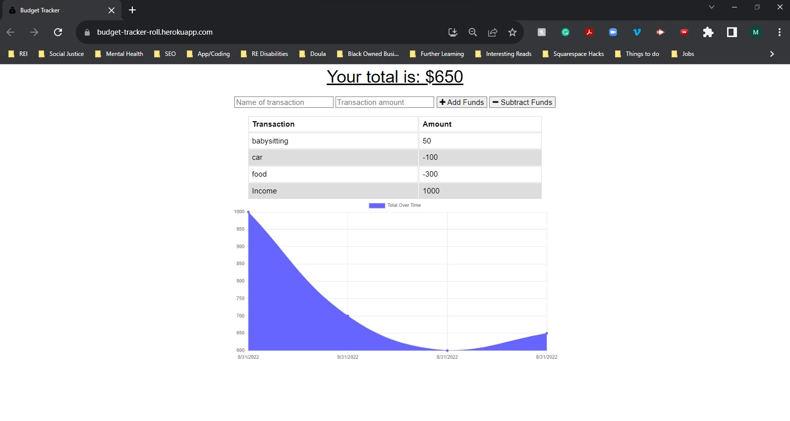
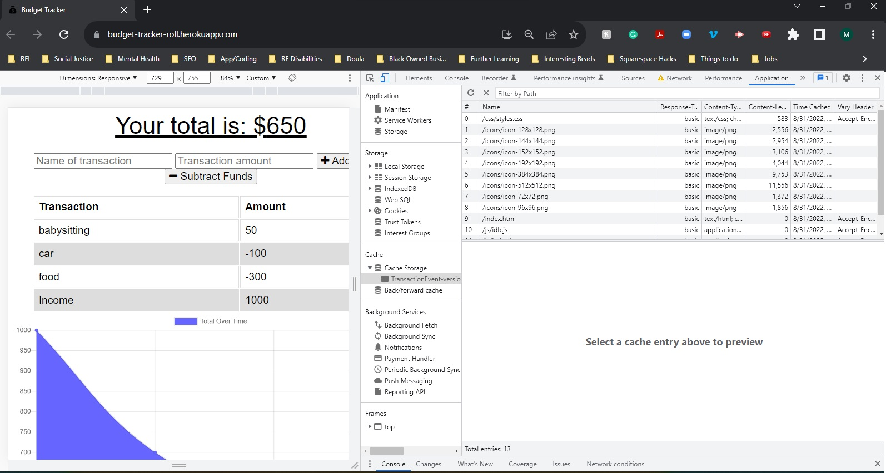
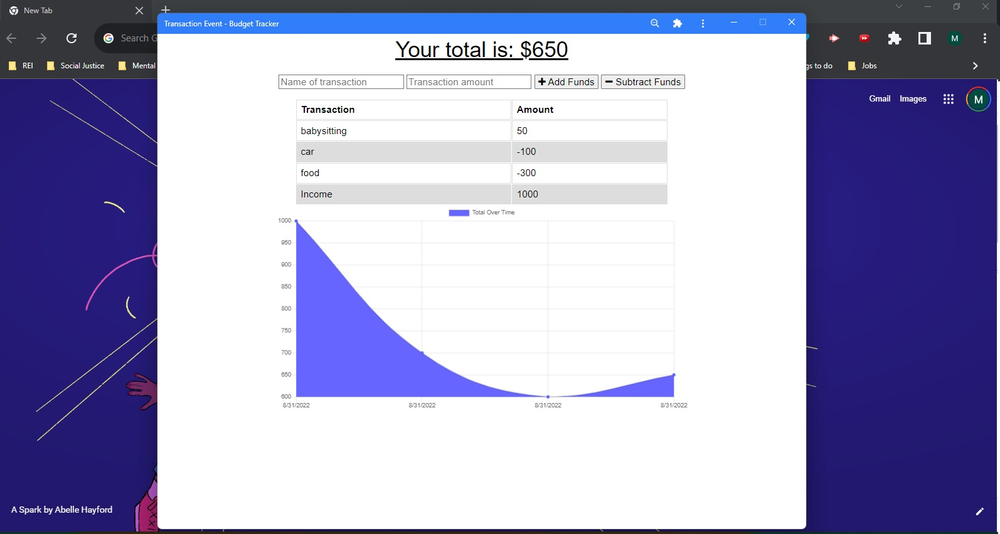

# Budget Tracker

This a budget tracker application to allow for offline access and functionality. The user will be able to add expenses and deposits to their budget with or without a connection. If the user enters transactions offline, the total should be updated when they're brought back online.

## Table of contents

- [Installation](#installation)
- [Application Criteria](#application-criteria)
- [Links](#links)
- [Tools Used](#tools-used)
- [Application Images](#application-images)
- [License](#license)

## Installation

The JSON file will have the necessary dependencies. Type this in your command line:

```
npm i
```

Start the application :

```
npm start
```

Open in prefered browser

## Application Criteria

GIVEN a budget tracker without an internet connection

- WHEN the user inputs an expense or deposit
  THEN they will receive a notification that they have added an expense or deposit
- WHEN the user reestablishes an internet connection
  THEN the deposits or expenses added while they were offline are added to their transaction history and their totals are updated

## Links

- [Github Repository](https://github.com/MtendeRoll/budgetTracker)
- [Deployed Application](https://budget-tracker-roll.herokuapp.com/)

## Tools Used

- [Express JS](https://www.npmjs.com/package/express)
- [Mongoose](https://www.npmjs.com/package/mongoose)

## Application Images

- Deployed Application
  
- Cached Storage
  
- Web Manifest
  

## License

- [MIT](./LICENSE)
